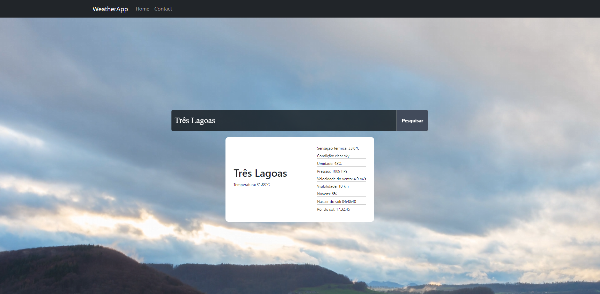

# WeatherApp

 <!-- Adicione um link para uma captura de tela do seu aplicativo -->

## Descrição

WeatherApp é um aplicativo web desenvolvido em React que permite aos usuários buscar informações meteorológicas detalhadas de diferentes cidades. A aplicação fornece dados atualizados sobre o clima, incluindo temperatura, umidade, condições climáticas e muito mais.

## Funcionalidades

- Busca por cidades para obter informações meteorológicas.
- Informações em tempo real sobre o clima.
- Design responsivo e intuitivo.
- Integração com API para dados meteorológicos.

## Como Usar

1. Acesse o [WeatherApp](https://rmterayama.github.io/WeatherApp/).
2. Digite o nome de uma cidade no campo de busca.
3. Visualize as informações meteorológicas exibidas na tela.

## Tecnologias Utilizadas

- **React**: Biblioteca JavaScript para construir interfaces de usuário.
- **openweather**: Para fazer chamadas HTTP à API de clima.
- **CSS**: Para estilização e design responsivo.

## Como Contribuir

1. Faça um fork do projeto.
2. Crie uma nova branch com suas alterações (`git checkout -b feature/MinhaNovaFuncionalidade`).
3. Faça commit das suas alterações (`git commit -m 'Adicionando nova funcionalidade'`).
4. Envie para o repositório remoto (`git push origin feature/MinhaNovaFuncionalidade`).
5. Abra um Pull Request.

## Licença

Este projeto está licenciado sob a MIT License - veja o arquivo [LICENSE](LICENSE) para mais detalhes.

## Contato

- **Nome**: Masayuki Terayama
- **GitHub**: [RMTerayama](https://github.com/RMTerayama)
- **Email**: [seu-email@example.com](mailto:seu-email@example.com)

---

Sinta-se à vontade para entrar em contato caso tenha perguntas ou sugestões sobre o projeto!
